# Mi primer repositorio

Para el reto #2 se trabajó en las aplicaciones de visual studio code, git, bloc de notas y simbolo de sistema. 

Esto con el fin de probar el funcionamiento de estas dentro de lo que se necesita para la clase, programación.

## RETO 1 "BLOG DE NOTAS"

### Paso 1

En el primer paso se copió el código dado por el profesor, y se pegó en el blog de notas 

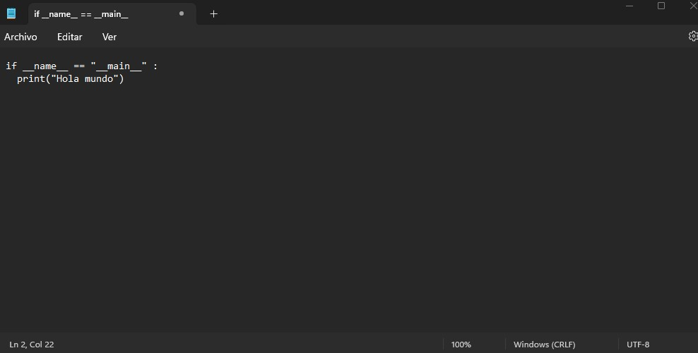

Codigo dado:
```
if __name__ == "__main__" :
  print("Hola mundo")
```

### Paso 2

Se creó una carpeta en documentos, con un nombre cualquiera (En este caso MARKDOWN 1), y el documento que tenemos en el blog de notas se guardó en esta carpeta como un archivo .py (python).

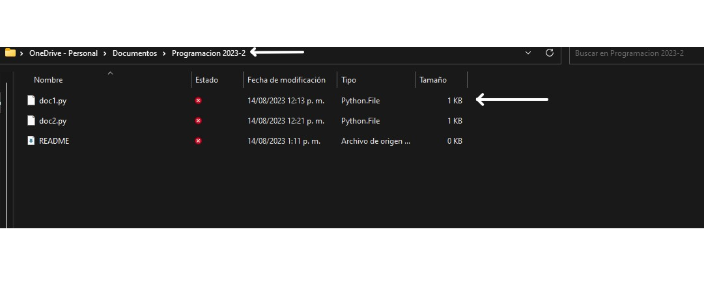

Siendo la flecha de arriba el nombre de la carpeta, y la de abajo el documento .py

### Paso 3

En la carpeta que se creo en documentos, ahora se presiona simultáneamente la tecla Shift con click derecho sobre el documento .py.

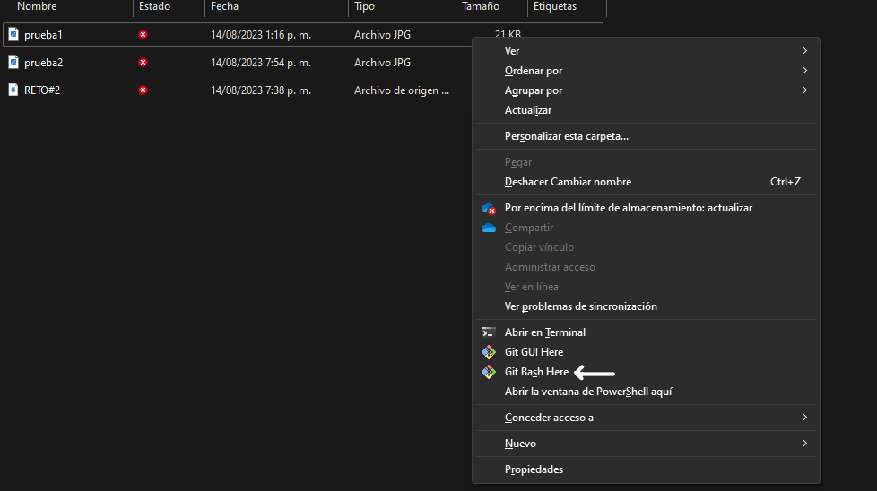

Como se puede observar se abrio una pestaña con varias opciones, se debe presionar en la que dice git bash here, tal cual señala la flecha en la imagen, ya que esto abrira el archivo en la app de git.

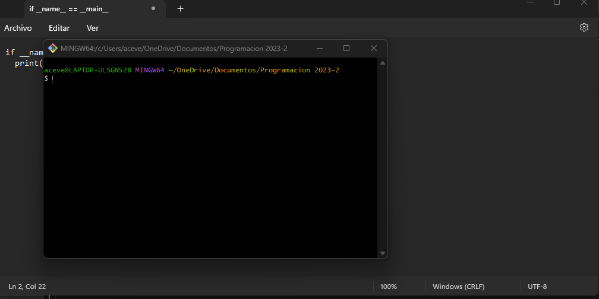

Al abrir git se debe abrir una ventana igual a esta.

### Paso 4

Se escribió el siguiente comando en git : "python namefile.py". 

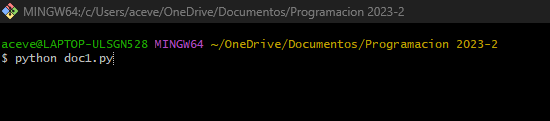

Le damos enter y deberá ejecutarse el codigo apareciendo el "hola mundo"

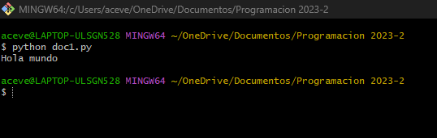

## RETO 2 "Simbolo de sistema"

Se debera escribir python en el comando y presionar enter ya que esto permitira que entrar en el lenguaje de programación y que los codigos funcionen adecuadamente

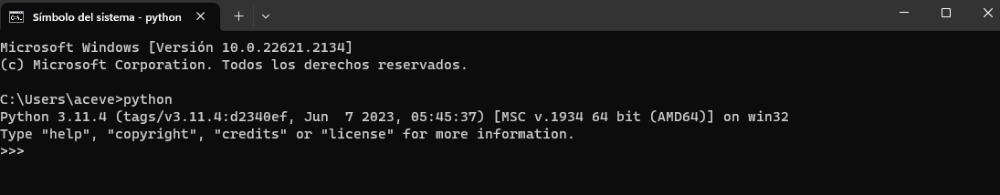

Ahora se pegara el codigo y se le dara enter dos veces, apareciendo asi el mensaje de hola mundo

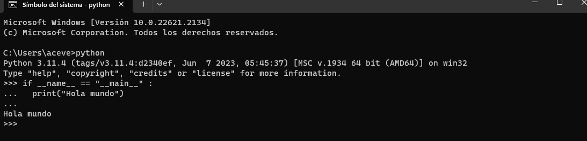

## RETO 3 "Python"

Para esto se debe abrir la aplicación de python, previamente instalada y se abrira algo parecido a simbolo de sistema, se debe pegar el codigo y al igual que en el reto anterior, darle enter dos veces y el programa correra el codigo enseñando el hola mundo

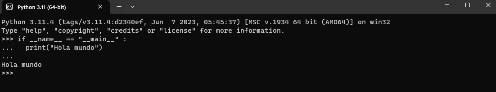

## RETO 4 "VISUAL STUDIO"

### Paso 1

Como primer paso se debe crear un archivo en visual studio code, por lo que se debe dar click a la pestaña file en la ventana superior, y nuevamente click a new file en la pestaña emergente.

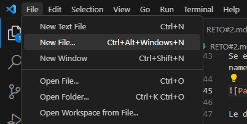

En la parte superior de la pantalla se abrirá un buscador en el que se debe colocar python, ya que es el lenguaje de programacion que se esta implementando en el codigo.

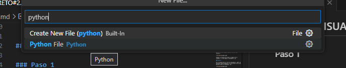

Se debe dar click en la opción y esto abrira el archivo.py

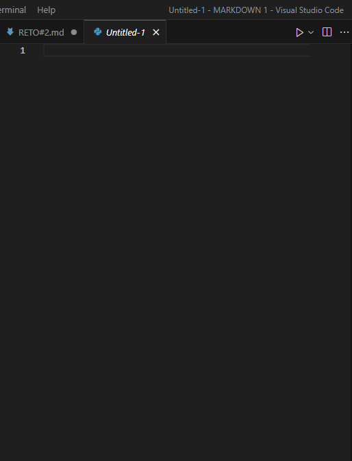
 
Y se procede a guardar el archivo presionando nuevamente file, pero ahora dando click en save us, y guardandolo donde se desee.
### Paso 2

La siguiente tarea fue colocar el codigo en el archivo, por lo que se copio y pego el codigo dado por el profesor, viendose de esta manera:

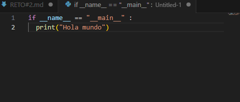

### Paso 3

Para comptobar que el codigo es correcto, se debe dar en el boton que parece una flecha arriba a la derecha, ya que este correra el codigo

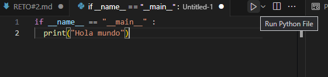

Al correr el codigo en la parte de la terminal debera salir el Hola mundo indicando que el codigo funciona correctamente

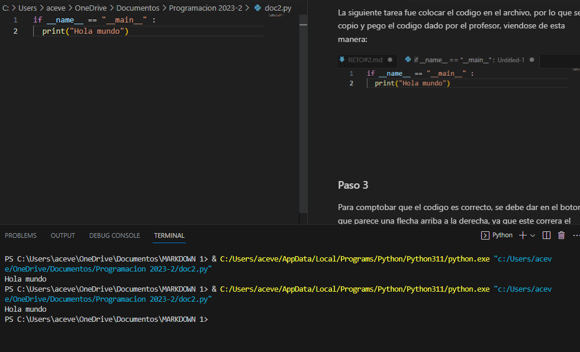
